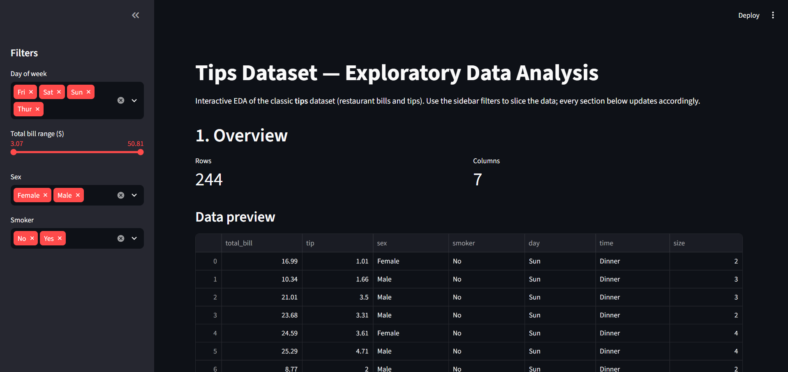
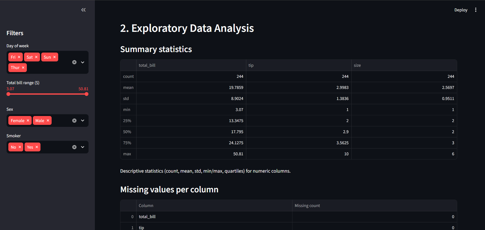
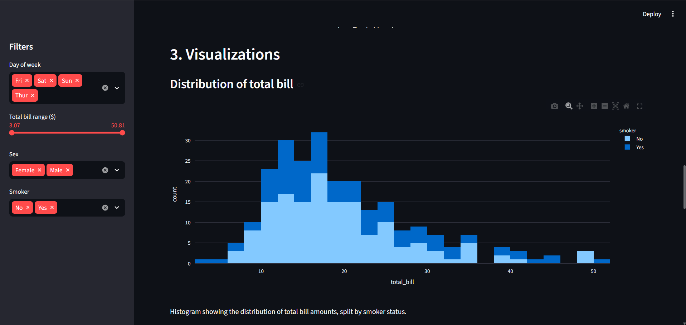

# Tips Dataset EDA — Streamlit App

## Dataset

**Source:** [seaborn built-in datasets](https://github.com/mwaskom/seaborn-data) — the classic `tips` dataset.

The dataset contains 244 records of restaurant bills, collected by a food server, with columns:

- `total_bill` — total bill amount ($)
- `tip` — tip amount ($)
- `sex` — sex of the bill payer
- `smoker` — whether the party included a smoker
- `day` — day of the week
- `time` — Lunch or Dinner
- `size` — size of the party

It was chosen because it mixes numeric columns (`total_bill`, `tip`, `size`) with categorical columns (`sex`, `smoker`, `day`, `time`), making it well suited for demonstrating filters, correlation analysis, and a variety of chart types.

A local copy is saved at `data/dataset.csv`.

## What the app does

`app.py` is a single-file Streamlit app that:

- Loads and caches the CSV data.
- Provides sidebar filters (day of week, sex, smoker status, and a total-bill range slider) that drive every section of the app.
- **Overview** — row/column counts, a data preview table, and a dtypes table.
- **EDA** — summary statistics (`describe()`), missing-value counts, and a correlation heatmap for numeric columns.
- **Visualizations** — an interactive histogram, scatter plot, bar chart, and box plot (all built with Plotly), each with a short description of what it shows.
- Gracefully handles the case where the selected filters return no rows.

## Setup (using uv)

```bash
uv sync
```

This creates a `.venv` and installs all dependencies declared in `pyproject.toml` (streamlit, pandas, numpy, matplotlib, seaborn, plotly).

## Run the app

```bash
uv run streamlit run app.py
```

Then open the URL printed in the terminal (typically http://localhost:8501).

## Screenshots






